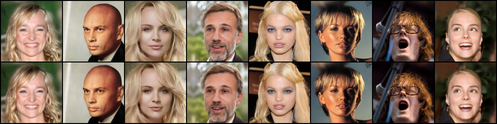

# Diffusion Transformer (DiT)

## Credits & Acknowledgements
This project is a reimplementation of [DiT-PyTorch] by [explainingai-code] (https://github.com/explainingai-code/DiT-PyTorch)
The code has been rewritten from scratch while maintaining the core concepts and functionalities of the original implementation.

## Features
- A Variational Autoencoder (VAE) to compress images into latent space and decoded latent data back into image space.
- A Diffusion Transformer (DiT) that can accept both image data or latent data.
- Both are coded in such a way that can be modified using a config file.

## Description of files in dataset
- **custom_dataset.py** - Create a custom datset for CELEB that can be configured to return either image data or latent data.

## Description of files in models
- **blocks.py** - Contain the codes for the construction of essential blocks for both autoencoder and diffusion models.
- **VAE.py** - A Variational Autoencoder for compressing images into latent data or reconstruction from latent data.
- **discriminator.py** - A discriminator model that is used to evaluate the reconstruction performance of an autoencoder.
- **lpips.py** - A pretrained model that is used to evaluate the perception loss from the reconstruction result by an autoencoder (The pretrained weight can be located in the weights folder).
- **patch_embed.py** - A patch embedding block that patchify the input images for DiT.
- **attention.py** - An attention block.
- **transformer_block.py** - A single transformer block.
- **DiT.py** - The backbone of the Diffusion Transformer Model.

## Description of files in scheduler
- **linear_noise_scheduler.py** - A linear noise scheduler that is needed in forward diffusion to add noise and in reverse diffusin to remove noise.

## Description of files in tools
- **train_VAE.py** - Trains a VAE model.
- **train_DiT.py** - Trains a Diffusion Transformer model.
- **infer_VAE.py** - To extract images in the form of latent data and reconstruct images from extracted latent data using VQVAE.
- **infer_DiT.py** - To generate images using a trained Diffusion Transformer.

## Description of files in utils
- **diffusion_utils.py** - To load latent data.

## Results
- Note: The results displayed for DiT is generated by models that did not trained to the best optimal outcome due to the lack of cheap computational power. (Only trained up to ~300 epochs)

- A) **Reconstruction of images using the latent data extracted by a VAE trained with CELEB**

- B) **Generation results using the Diffusion Transformer, trained with CELEB**

